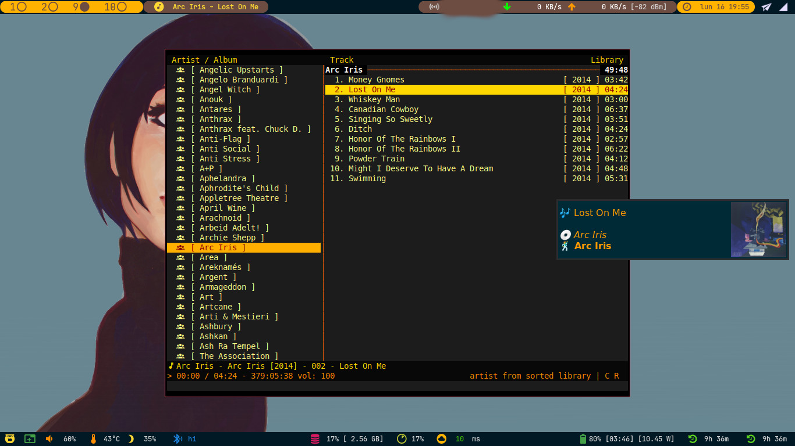

# cmus_notify
cmus_notify is a python script which sends a notification on song change using notify-send.


# Installation

You must have stagger in your path.
You can install it using pip.

```bash
mkdir -p ~/.config/cmus/scripts
cd ~/.config/cmus/scripts
git clone git@github.com:wdog/cmus_notify.git
cd cmus_notify
pip install -r requirements.txt
chmod +x songChange.py
# optional step for LastFM
cp secret.example.json secret.json
```

Fill the file `secret.json` with your LastFM api key, secret, username and
password

Once you have requirements installed, just add this line to your `~/.config/cmus/rc` or `~/.config/cmus/autosave`.

```
set status_display_program=~/.config/cmus/scripts/cmus_notify/songChange.py

```

# Help

```
usage: songChange.py [-h] [-l] [-s]

optional arguments:
  -h, --help       show this help message and exit
  -l, --lastFm     Enable LastFm cover
  -s, --scrobbing  Enable LastFm scrobbing
```


